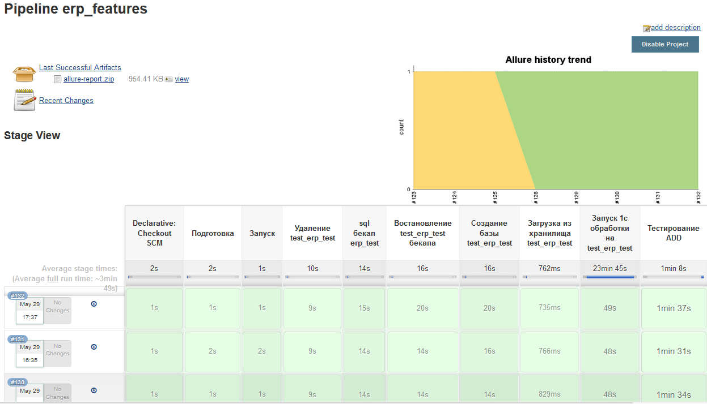
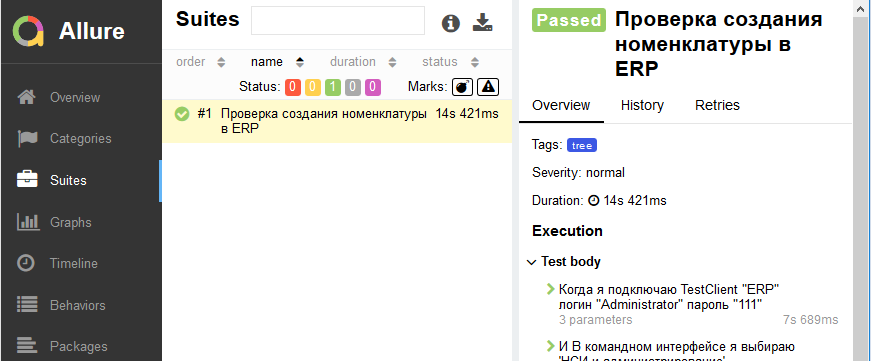
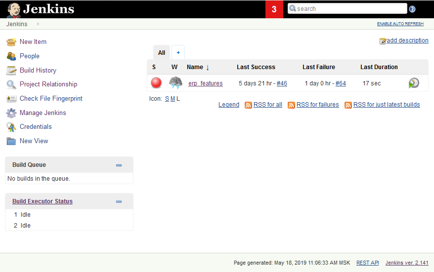
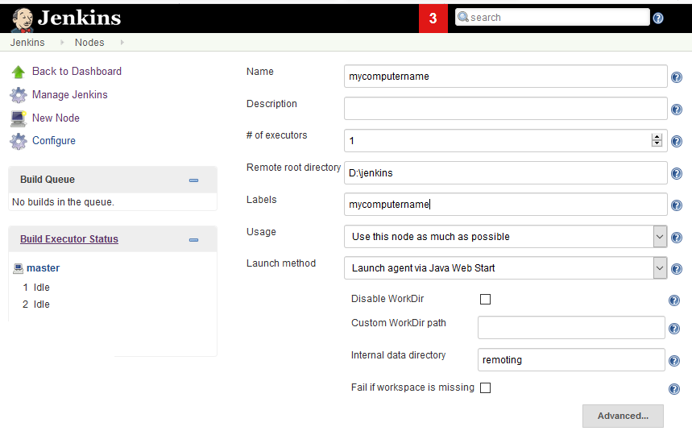
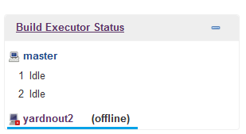
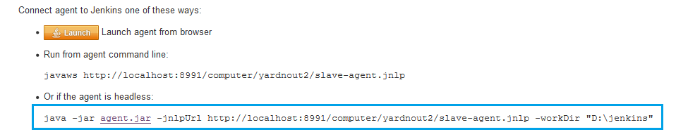
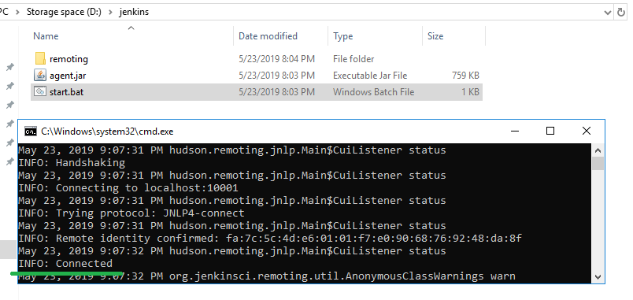
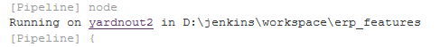

### См. оригинал статьи на Infostart https://infostart.ru/public/1070720/

# Переводим рутину ручного тестирования 1C на рельсы Jenkins-а и ADD

Вы все еще тестируете свои конфигурации 1С вручную? Да вы просто тратите жизнь впустую! Регулярные читатели инфостарта должны уже слышать  ( и не по наслышке знать) про Vanessa Behavior  и его новых отпрысков – ADD и Vannessa Automation.  

Оба  фреймворка – это замечательное воплощение идей удобного тестирования  функциональности на 1С. Мы составляем cценарные тесты(или «фичи»)  на специальном языке gherkin, описывающим поведение пользователя в интерфейсе 1С Предприятия, а затем вручную прогоняем тесты на запускалке – внешней обработке 1С и узнаем, что у нас работает, а что не очень. Если вы еще не пробовали рай автоматического BDD тестирования, то данный туториал будет максимально полезен: мы сразу убъем двух зайцев – на практическом примере узнаем, что это такое и научимся его правильно готовить.

Под правильной готовкой мы будем понимать не запуск тестов вручную (желающим в руки достаточно «плотный» [материал про Ванессу](https://infostart.ru/public/969637/)), а создание переиспользуемого пайплайна тестирования в Jenkins. Пайплайн, который будет сам автоматически по расписанию запускать тесты. Пайплайн, который не будет ломать вам рабочие базы. Пайплайн, который даст удобный allure отчет. Наконец, пайплайн, который принесет  уверенность в завтрашнем дне! 

Звучит хорошо, не правда ли? Но сбавим градус пафоса, господа…  и перейдем от теории сразу к практике. Все действия будут выполняться под Windows.

Для наших практических экспериментов потребуется следующий софт:
* Jenkins
* One script и либы (Спасибо [EvilBeaver](https://github.com/EvilBeaver))
* ADD 6.0.0 (Спасибо [SilverBulleters](https://silverbulleters.org/))
* Серверная платформа 1С с развернутой серверной базой не ниже 8.3.10

На картинках конечный результат будет выглядеть вот так:

#### Статистика сборок

#### Отчет о сборке


### Как будет работать наш пайплайн:
Весь смысл пайплайна в том, чтобы прогнать тесты на желаемой базе (или базах). И чтобы не портить саму эталонную тестовую базу (далее просто эталонная), мы будем работать исключительно с копией. Копирование баз выполняется  средствами sql Давайте разберем последовательность этапов, который выполняет этот мега-пайплайн:
1. Удаляет копию эталонной базы из кластера (если она там была) и очищаем клиентский кеш 1с
2. Делает sql бекап эталонной базы, которую нужно загружать в копию.
3. Загружает sql бекап эталонной базы в копию
4. Создает копию в кластере 1С с префиксом test_
5. Обновляет копию из хранилища 1С (если есть хранилище)
6. Запускает внешнюю обработку 1С на копии, которая очищает базу от всплывающего окна с тем, что база перемещена при старте 1С
7. Запускает внешнюю обработку ADD на копии и прогоняет тесты
8. ПО результатам тестов формирует отчет allure

Итак, приступаем к установке.

## 1. Установка GIT

GIT - наверное уже известная всем система контроля верси кода, которая все больше входит в жизнь 1С-ков. Она нам потребуется для того, чтобы  дженкинс смог работать со скриптами нашего пайплайна, которые расположены в экспериментальном репозитории https://github.com/ripreal/erp_features.git (данные репозиторий подойдет, чтобы выполнить туториал, но для разворачивания на продакшене рекомендуется завести свой). Для этого:
* Скачиваем последний [дистрибутив GIT for Windows](https://git-scm.com/) и устанавливаем

## 2. Установка и настройка Jenkins-а.

Jenkins – бесплатная среда для автоматического запуска всех скриптов нашего пайплайна по расписанию.  Установка  и первичная настройка дженкинса не принесет никаких проблем.
1. Скачиваем [дистрибутив JRE 1.8](https://www.java.com/en/download/) и устанавливаем
2. Скачиваем последний [дистрибутив Jenkins](https://jenkins.io/) (на момент статьи это 2.141) и устанавливаем как сервис. Все настройки оставляем по-умолчанию.
3. Меняем стандартную кодировку дженкинса на UTF-8. Это важный этап, чтобы в веб-интерфейсе дженкинса все русские символы отображались корректно. Для этого добавляем параметр -Dfile.encoding=UTF8 в тег <arguments> в файле Jenkins.xml, расположенном в корневом каталоге установки дженкинса. Итоговая строка должна выглядеть примерно так:

```<arguments>-Xrs -Xmx256m -Dhudson.lifecycle=hudson.lifecycle.WindowsServiceLifecycle -Dfile.encoding=UTF8 -jar "%BASE%\jenkins.war" --httpPort=8991 --webroot="%BASE%\war"</arguments>```

4. Перезапускаем службу Jenkins в диспетчере задач Windows и проверяем, что все прошло хорошо, открыв веб-интерфейс дженкинса по адресу http://localhost:8080. Если у вас порт 8080 занят другим приложением, то необходимо будет его перенастроить, например как написано [здесь](https://stackoverflow.com/questions/23769478/how-to-change-port-for-jenkins-window-service-when-8080-is-being-used)



## 3. Настройка shared-libraries

Эта удобная функция позволяет писать и складывать скрипты в отдельные библиотеки для их переиспользования в дальнейшем. Мы будем использовать эти библиотеки постоянно.
1. В веб-интерфейсе дженкинса переходим в меню Manage Jenkins (Настроить Jenkins) => Configure System (Конфигурация системы) => Global Pipeline Libraries
2.Нажимем Add и заполняем поля:
* Name: shared-libraries
* Default version: master
* Retrieval method: modern SCM
* Source Code Management: Git (не GitHub)
* Poject Repository: https://github.com/ripreal/erp_features.git

## 4. Настройка Allure

Аллюр позволит генерировать красивые отчеты прямо в дженкинсе по результатам  тестирования в ADD.
1. Устаналиваем плагин allure. В веб-интерфейсе дженкинса переходим в меню Manage Jenkins (Настроить Jenkins) => Manage plugins (Управление плагинами) => Available (Доступные), ищем в списке Allure и устанавливаем его
2. Устанавливаем сам дистрибутив allure. В веб-интерфейсе переходим Manage Jenkins (Настроить Jenkins) => Global Tool Configuration (Конфигурация глобальных инструментов) => Allure Commandline installations => Add Allure Commandline. Заполняем появившиеся поля следующим образом
* Name: allure
* Label: allure
* Download URL for binary archive: https://dl.bintray.com/qameta/maven/io/qameta/allure/allure-commandline/2.11.0/allure-commandline-2.11.0.zip
* Subdirectory of extracted archive: allure

## 5. Настройка окружения ADD 

Переходим к установке непосредственно самих утилит, нужных для работы вспомогательных административных скриптов и самого инструмента ADD.

1. Скачиваем последний [дистрибутив OneScript](http://oscript.io/downloads) и устанавливаем.
2. Устанавливаем библиотеку vannessa-runner для OneScript. Для этого выполняем команду:

```opm install vanessa-runner```

3. Таким же образом устанавливаем библиотеку add

4. Также у вас уже должны быть установлены sqlcmd (поставляется вместе с MS SQL Server) и  powershell (с включенной Windows политикой беспрепятственного запуска скриптов) 
 
 ## 6. Создание и настройка пайплайна в Jenkins

 Теперь самое интересное - создать и настроить пайплайн, который и будет запускать по расписанию весь процесс сборки, начиная с копирования эталонных баз и заканчивая их тестированием и очисткой.

 1. В Веб-интерфейсе дженкинса переходим в меню New Item (Создать Item), заполняем произвольное имя в поле Enter an item name (Введите имя Item'а), я выбрал erp_features, выбираем тип скрипта - pipeline и нажимаем ОК
 2. В новом окне открывается конфиг пайплайна. Переходим к группе pipeline, в котором мы введем настройки подключения к репозиторию, в котором хранятся все исходники. Заполняем поля следующим образом:
 * Definition - pipeline script from SCM
 * SCM - git
 * Repository URL - https://github.com/ripreal/erp_features.git (или свой)
 * В группе Additional Behaviours нажимаем кнопку add и выбираем clean before checkout, чтобы автоматически очищать директорию сборки от предыдущих результатов.
3. Все остальные параметры оставляем по-умолчанию и нажимаем Save

## 7. Первый запуск пайплайна

На самом деле мы неполностью настроили конфиг пайплайна, т.к. часть параметров конфига  хранятся в Jenkinsfile - скрипте в удаленном репозитории,который мы указали в п.6. Поэтому чтобы донастроить пайплайн необходимо выполнить пробный запуск. Для этого:
1. В Веб-интерфейсе дженкинса на главной странице переходим в наш пайплайн erp_features
2. В открывшемся окне нажимаем Build (Собрать сейчас) в левой командной панели и наблюдаем процесс сборки. Сборка должна будет упасть - это нормально.
3. Обновляем браузер через f5 и видим, что теперь у нас вместо кнопки Buid появится другая кнопка Build with parameters (Собрать с параметрами) - это как раз то, что нам нужно.


## 8. Второй запуск пайплайна

Теперь самое время перейти в реальному запуску пайплайна. Для этого в меню с пайплайном erp_features нажимаем кнопку Build with parameters (Собрать с параметрами), которая появилась вместо Build (Собрать) и видим список параметров со значениями NULL, которые нам нужно заполнить. В качестве тестовой базы я выбрал серверную демобазу ERP. Рекомендую последовать моему примеру, т.к. пробный feature тест ([здесь](https://github.com/ripreal/erp_features/blob/master/features/test.feature)) написан для этой конфигурации. Отметим, что значения всех введенных параметров будут сохранены для следующих запусков пайплайна. Примечание - обязательно уберите из всех параметров значение NULL, иначе сборка при запуске будет ругаться.  Если параметр не хотите заполнять, то оставьте его просто пустым:

* jenkinsAgent - Нода дженкинса, на которой запускать пайплайн. Рекомендую на первое время ставить master. По умолчанию также стоит master	
* server1c - Имя сервера 1с, по умолчанию localhost
* server1cPort - Порт рабочего сервера 1с. По умолчанию 1540. Не путать с портом агента кластера (1541)
* serverSql - Имя сервера MS SQL. По умолчанию localhost
* admin1cUser - Имя администратора с правом открытия внешних обработок (!) и с отключенной защитой от опасных действий для базы тестирования 1с Должен быть одинаковым для всех баз.
* admin1cPwd - Пароль администратора базы тестирования 1C. Должен быть одинаковым для всех баз
* sqlUser - Имя администратора сервера MS SQL. Если пустой, то используется доменная  авторизация
* sqlPwd - Пароль администратора MS SQL.  Если пустой, то используется доменная  авторизация
* templatebases - Список баз для тестирования через запятую. Например work_erp,work_upp
* storages1cPath - Необязательный. Пути к хранилищам 1С для обновления копий баз тестирования через запятую. Число хранилищ (если указаны), должно соответствовать числу баз тестирования. Например D:/temp/storage1c/erp,D:/temp/storage1c/upp
* storageUser - Необязательный. Администратор хранилищ  1C. Должен быть одинаковым для всех хранилищ
* storagePwd - Необязательный. Пароль администратора хранилищ 1c


Теперь запускаем сборку и ждем ее полного выполнения. В идеале сборка должна выполниться успешно и отобразиться зеленым цветом. Если сборка упадет на каком-то из промежуточных шагов, то лезем в логи по кнопке Console Output (Вывод консоли) в левой панели, которая доступна, если провалится в саму сборку. Если пайплайн зависает на этапе запуска 1С-ых обработок (Этапы "Запуск 1с обработки на test_temp" и "Тестирование ADD"), то скорее всего внутри 1С всплыло какое-то модальное окошко, блокирующее дальнейшую работу. Для этого запустите в 1С созданную в пайплайне копию базы в режиме предприятия и проследите, чтобы не всплывало никаких блокирующих окон.

## Меняемся к лучшему 1 - Настройка slave ноды дженкинса

После установки дженкинса мы получаем одну master ноду, запущенную как системный процесс. Но в приличном jenkins обществе принято использовать master ноду только в качестве менеджера slave агентов, а не ка запускалку пайплайнов. Поэтому чтобы не создавать на нее лишнюю нагрузку и не вешать ее в случае какого-либо неоптимального кода, заводятся slave ноды. 

Для нас необходимость второй ноды обсусловлена еще и сугубо утилитарными нуждами - для правильной работы нашего пайплайна требуется нода, запущенная не как служба, а как консольное приложение. Дело в том, что ADD запускается в среде 1С со всем полагающимся графическим интерфейсом. Если мы будем запускать ADD под master нодой, то мы просто не увидим процесс выполнения ADD тестов на нашей машине (хотя это не помешает успешному выполнению тестов) Для простоты развернем slave на той же машине, на которой запущен и master. Итак, наши шаги будут следующими:

1. Разрешаем запуск слейв агентов в качестве консольных приложений. Для этого в веб-интерфейсе дженкинса переходим в меню Manage Jenkins (Настроить Jenkins) => Configure Global Security (Глобальные настройки безопасности) => Agents и в поле TCP port for JNLP agents меняем переключатель на Fixed (Статичный) и указываем порт, например 10001.
2. Добавляем ноду. Для этого переходим в меню Manage Jenkins (Настроить Jenkins) => Manage Nodes (Управление средами сборки) и в левой командной панели нажимаем New Node (Новый узел), вводим имя, активируем переключатель Permanent Agent и жмем ок.
3. Вводим параметр ноды:
* Name - имя хоста (компьютера)
* Remote root directory (Корень удаленной ФС) - произвольный путь к каталогу, в котором дженкинс будет выполнять пайплайны, например D:\jenkins
* Labels (Метки) - произвольное имя, по которому будем ссылаться на ноду в пайплайне. Рекомендую ставить такое же, как имя ноды.
* Launch method (Способ запуска) - выбираем Launch agent via Java Web Start
4. Жмем save


Теперь нужно поднять ноду:

* В главном меню дженкинса в левой части должна появится иконка нашей новой ноды.



* Кликаем на нее и смотрим на последнюю строчку. Это и есть командная строка запуска slave ноды. 



* Копируем командную строку и записываем ее в bat-ник,  заодно скачиваем agent.jar по гиперссылке. Все это ложим в каталог, который мы выделили ранее для slave дженкинса и запускаем bat-ник. Если все сделано правильно, то через пару секунд запустится консольная слейв нода.



5. Самое время првоерить работоспособность слейв ноды на нашем пайплайне. Для этого переходим к вводу входных параметров пайплайна, меняем параметр jenkinsAgent на label, который мы указали во время настройки ноды и запускаем пайплайн.  В логах запущенной сборки можно увидеть, что пайплайн запустился на слейве



## Меняемся к лучшему 2 - Установка nircmdm для скриншотов в отчете allure

Чтобы лицензреть в allure вот такие вот полезные скриншоты при падении шагов теста, нам потребуется установить утилитку nircmdm. Возьмем на карандаш также то, что снятие скриншотов будет работать только под slave нодой, запущенной в консольном режиме.


Для этого: 
* Скачиваем архив отсюда http://www.nirsoft.net/utils/nircmd.html
* Запускаем из архива nircmd.exe под администратором и выбираем copy to windows directory 
* Проверьте, что через cmd.exe у нас появилсь новая команда nircmd. Если все ок, то больше никакой настройки в дженкинсе для скриншотов не требуется 

## Меняемся к лучшему 3 - Создание расписания для пайплайна

Запуск по расписанию - отличная идея для автоматичеких ночных сборок. Так что приступим:
1. В Веб-интерфейсе дженкинса на главной странице переходим в наш пайплайн erp_features
2. В левой панели нажимаем Configure (Настройки) и ставим галочку Build periodically (Запускать периодически)
3. Вводим расписание по формату CRON. Для того, чтобы запускать каждую ночь в 12 часов, достаточно ввести следующее выражение H 00 * * 1-7

## Меняемся к лучшему 4 - Копаемся во внутренностях Jenkinsfile-а

Я всячески поощряю залезть в [главный исполняемый скрипт нашего пайплайна](https://github.com/ripreal/erp_features/blob/master/Jenkinsfile) и посмотреть как это работает своими глазамами. Jenkinsfile находится в корневом каталоге репозитория https://github.com/ripreal/erp_features.git. Скрипты в jenkins пишутся на очень простом процедурном языке groovy - ванильной надстройкой над java. При желании скрипт можно и нужно подтюнить. Подкину пару идей для улучшения:
1. Сделать пайплайн более масштабируемым - вместо ручного ввода входных параметров, запрашивать их из внешних key-value storage-ов
2. Добавить smoke тесты - делается аналогично шагу "Тестирование ADD"
3. Отправлять уведомления и результаты выполнения сборок на почту или в корпоративный чат
4. Добавит CD - финальным шагом пайплайна не просто запускать тесты, но и делать автосборку файла поставки проверенной конфигурации.

На этом у меня все. Осталось сказать, что данный туториал может пригодится не просто как средство, чтобы разобраться с автоматизацией ADD, но и как заготовка для построения собственного CI на ваших проектах. Собственно в моей команде мы используем схожий, но сильно продвинутый CI по подобию именно этого пайплайна.

## Благодарности

1. Артем Кузнецов (arkuznetsov) - за архитектурную идею скрипта для пайплайна дженкинса
